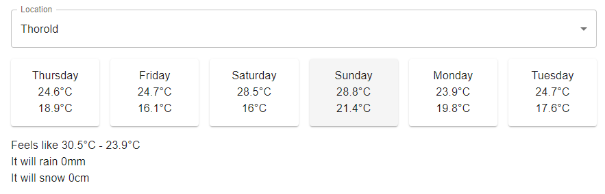

# Overview
This take-home programming assessment is designed for the candidate to demonstrate their knowledge of front-end development. It covers React state and hooks, common data fetching, API integration, etc. The visual "design" and styling of the final project is not critical to this assessment and does not need to follow the examples exactly.

# Output
The final result should be a web page that fetches the 7 day weather forecast from the free open-source [open-meteo](https://open-meteo.com/en) API and displays it on the page. Selecting one of the days will display more weather details about the selected day such as humidity, precipitation, etc (this is up to you).

UI Design is not important here as the code takes priority, however, effort to improve the UI will be noted. Here is an example of what the final output could look like:

## Time
This assessment should take approximately 1 hour to complete but more time may be taken if needed (there is no time limit).

## Libraries
You may use any of the libraries included in `package.json` including any components or icons from [material-ui](https://mui.com/)

## Open-Meteo
This weather API is free to use, no account is needed and no api-key is required. You can find the documentation [here](https://open-meteo.com/en/docs). The API uses Latitude and Longitude when giving weather predictions. We have provided a pre-build component `<LocationSelect/>` which can be used and has a few locations with their coordinates built in.

